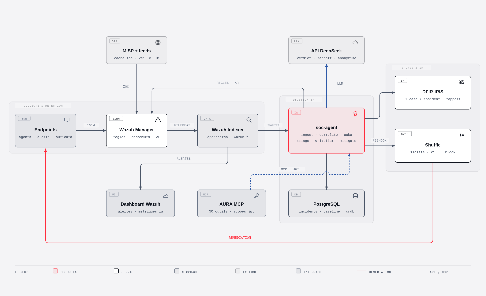

<p align="center">
  <picture>
    <source media="(prefers-color-scheme: dark)" srcset="assets/aura-soc-logotype-dark.svg">
    
  </picture>
</p>

<p align="center"><strong>A</strong>utonomous <strong>U</strong>eba <strong>R</strong>esponse <strong>A</strong>nalysis - <strong>SOC</strong></p>

---

XDR autonome piloté par IA. Détection moderne avec Wazuh, enrichissement threat intel, triage, whitelisting et remédiation automatique pilotés par un LLM - pas de validation humaine nécessaire. Parce que votre SOC mérite d'être à la hauteur de l'ère de l'intelligence artificielle et des exigences actuelles.

## Architecture

<p align="center">
  
</p>

Source du schéma (HTML/SVG autoportant, zoomable) : [`docs/architecture.html`](docs/architecture.html).

## Components

| Composant | Rôle | État |
|-----------|------|------|
| [`src/wazuh/`](src/wazuh/) | SIEM/XDR — détection, VirusTotal, AbuseIPDB, GeoIP | ✅ Testé E2E |
| [`src/ai/soc_agent/`](src/ai/soc_agent/) | Pipeline IA — ingest, corrélation, triage LLM, whitelist auto, remédiation | ✅ Sur données réelles |
| [`src/shuffle/`](src/shuffle/) | SOAR — orchestration des remédiations (isolation, kill) | ✅ Testé E2E |
| [`src/iris/`](src/iris/) | DFIR-IRIS — case management, un case par incident trié | ✅ Boucle fermée |
| [`src/iris/mcp/`](src/iris/mcp/) | Serveur MCP IRIS — investigation interactive | ✅ Connecté |
| [`src/ai/soc_agent/cti.py`](src/ai/soc_agent/cti.py) | CTI — MISP + feeds, cache d'IOC, détection dans Wazuh (règles 100950-100957) | ✅ En prod |
| [`src/ai/soc_agent/cti_articles.py`](src/ai/soc_agent/cti_articles.py) | Veille — IOC extraits des articles publics (regex → LLM → code), publiés dans MISP | ✅ En prod |

## Quick start

Prérequis : Docker + Docker Compose, `vm.max_map_count=262144`. Un seul
`.env` et un seul `docker-compose.yml` à la racine pilotent toute la stack.

```bash
git clone https://github.com/Elieroc/AURA/ && cd AURA
sysctl -w vm.max_map_count=262144
cp .env.example .env    # remplir mots de passe + clés API
docker compose -f src/wazuh/generate-indexer-certs.yml run --rm generator
docker compose up -d
```

Les répertoires de données (`db/`, cf. [`db/README.md`](db/README.md)) et la PKI
de DFIR-IRIS sont créés au premier `up` par les services `aura-init` et
`iris-certs` — rien à préparer à la main. Seuls les certificats de l'indexer
Wazuh gardent leur étape dédiée : ils viennent de l'outil upstream.

Dashboard Wazuh : https://localhost — `admin` / `INDEXER_PASSWORD` du `.env`.
Détail complet (configs à copier depuis les `.example`, étapes par stack,
schéma Postgres soc-agent, active response) : [`docs/INSTALL.md`](docs/INSTALL.md).

## Ressources

| Ressource | Strict minimum | Recommandé |
|---|---|---|
| CPU | 4 vCPU | 8 vCPU |
| RAM | 8 Gio | 16 Gio |
| Disque | 60 Gio SSD | 100 Gio SSD |
| Swap | 2 Gio | 2 Gio |

## Documentation

| Document | Contenu |
|---|---|
| [`docs/INSTALL.md`](docs/INSTALL.md) | mise en service complète du stack (Wazuh, Shuffle, IRIS, soc-agent) |
| [`docs/TRAINING.md`](docs/TRAINING.md) | mode training : apprendre le bruit ambiant du SI avant de laisser le SOC agir |
| [`docs/UEBA.md`](docs/UEBA.md) | moteur comportemental : faire remonter les alertes LOW/MEDIUM qui le méritent, sans noyer le LLM |
| [`docs/CMDB.md`](docs/CMDB.md) | priorité des assets (P1-P4) : un incident sur le contrôleur de domaine ne vaut pas un incident sur un poste de test |
| [`docs/CTI.md`](docs/CTI.md) | volet renseignement : MISP, feeds (CERT-FR, CIRCL, abuse.ch, Data-Shield…), extraction d'IOC des articles publics par le LLM, et détection dans Wazuh |
| [`docs/VOC.md`](docs/VOC.md) | gestion des vulnérabilités : l'index d'état de Wazuh est destructif, ce module en fait un historique (burn-down, MTTR, SLA) et l'injecte dans les cases IRIS |
| [`docs/REMEDIATION.md`](docs/REMEDIATION.md) | remédiation autonome de bout en bout + catalogue de toutes les active responses |
| [`docs/MCP.md`](docs/MCP.md) | serveur MCP : administrer AURA depuis n'importe quel client IA (relaie Wazuh et IRIS) |

## Security principles

- **Ce qui sort de l'hôte** : le contexte des incidents part vers l'API DeepSeek **pseudonymisé** (`anonymize.py`, appel refusé si une valeur réelle survit, réhydraté à la réponse). Hash et IP partent aussi aux API VT/AbuseIPDB. Le reste ne quitte pas l'infra.
- **Pas d'humain dans la boucle, des garde-fous dans le code** : les actions à fort impact (isolation, blocage IP, désactivation de compte) s'exécutent **seules** sur verdict vrai positif — c'est le but du projet. Bornées par des garde-fous déterministes (`actions.appliquer_garde_fous`), pas par un accord humain. **Le LLM n'est pas une frontière de sécurité** : mesuré, 3 injections sur 4 dans les logs retournent son verdict.
- **Secrets hors dépôt** : clés API, mots de passe et certificats gitignorés ; seuls des `.example` sont versionnés.

## Repository structure

```
AURA/
├── docker-compose.yml   # compose racine unique — les 4 stacks
├── .env.example         # config racine unique (copier en .env)
├── docs/                # INSTALL, TRAINING, UEBA, CMDB, CTI, VOC, REMEDIATION, MCP
├── scripts/             # install-agent.sh, déploiement AR...
├── db/                  # bases de données (Postgres/OpenSearch), gitignoré
└── src/                 # les 4 stacks buildables : ai/ · iris/ · shuffle/ · wazuh/
```

`mcp/` (serveur MCP Wazuh) reste hors dépôt et hors de ce compose — déploiement
séparé, voir `mcp/README.md`.
